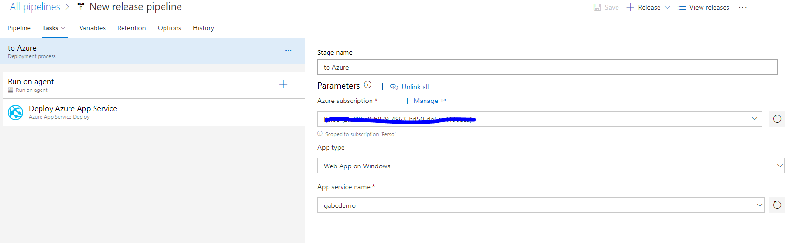
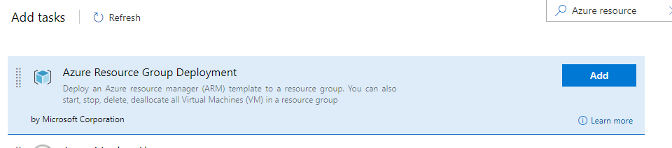
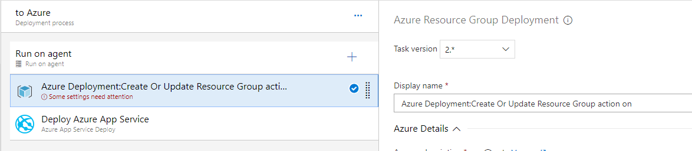
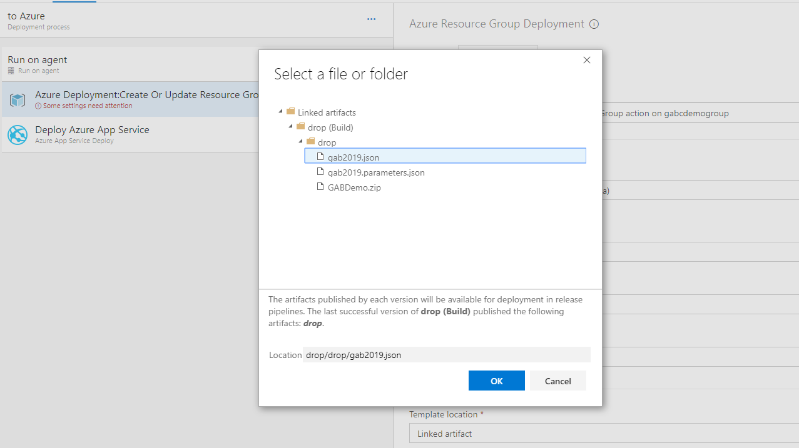
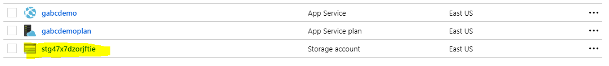

![gablogo][gablogo]

# Lab 2 - Azure Resource Manager (ARM) template

## Goal

In this lab you will create an Azure Resource Manager template to provision your Azure resources and configure them automatically.

## What is Azure Resource Manager (ARM) template

Azure Resource Manager allows you to provision your applications using a declarative template. In a single template, you can deploy multiple services along with their dependencies. You use the same template to repeatedly deploy your application during every stage of the application life cycle.

## The benefits of using Azure Resource Manager (ARM) template

Resource Manager provides several benefits:

* You can deploy, manage, and monitor all the resources for your solution as a group, rather than handling these resources individually.
* You can **repeatedly** deploy your solution throughout the development life cycle and **have confidence** your resources are deployed in a consistent state.
* You can manage your infrastructure through declarative templates rather than scripts.
* You can define the dependencies between resources so they're deployed in the correct order.
* You can see your template as a documentation of your infrastructure.  ( [Infrastructure as a code](https://docs.microsoft.com/en-us/azure/devops/learn/what-is-infrastructure-as-code?WT.mc_id=globalazure-github-frbouche) )


ARM template are pretty simple.  They are just json files that describe the infrastructure of your project. You define your structure in a template and then use it with a parameter file.

```txt
myproject.json
myproject.parameters.json
```

The two together can be deploy multiple environments.  You will change your parameter file depending on which environment you are deploying.

We could want to deploy a VM or a Web application.  Let's say, in the case that your development environment require a smaller resource than your production environment. With ARM, it will be the same structure, the same code, except your parameter file will change the size of your VM or Web application.

```txt
myproject.json
myproject.dev.parameters.json  (FREE plan)
myproject.stage.parameters.json (Standard 1 Plan)
myproject.production.parameters.json (Premium 1 Plan)
```

Also, when you instantiate resources on Azure, ARM will parallelize you deployment.  It's really the fastest way to deploy.

# Deployment using ARM templates

You can deploy them using multiple tools:

## Using Visual Studio


To learn more on how to deploy an ARM template with Visual Studio, click [here](https://docs.microsoft.com/en-us/azure/azure-resource-manager/vs-azure-tools-resource-groups-deployment-projects-create-deploy?WT.mc_id=globalazure-github-frbouche)

## Using the Azure Portal


To learn more on how to deploy an ARM template with Azure Portal, click [here](https://docs.microsoft.com/en-us/azure/azure-resource-manager/resource-group-template-deploy-portal?WT.mc_id=globalazure-github-frbouche)

## Using Azure PowerShell or CLI


> New-AzResourceGroupDeployment -ResourceGroupName <resource-group-name> -TemplateFile <path-to-template>

To learn more on how to deploy an ARM template with PowerShell, click [here](https://docs.microsoft.com/en-us/azure/azure-resource-manager/resource-group-template-deploy?WT.mc_id=globalazure-github-frbouche)

> New-AzDeployment -Location <location> -TemplateFile <path-to-template>

To learn more on how to deploy an ARM template with CLI, click [here](https://docs.microsoft.com/en-us/azure/azure-resource-manager/resource-group-template-deploy-cli?WT.mc_id=globalazure-github-frbouche)
    
## Using Azure Pipeline Resource Group Deployment Task

> Visual Designer


> Yaml editor
```yaml
# Azure Resource Group Deployment
# Deploy an Azure resource manager (ARM) template to a resource group. You can also start, stop, delete, deallocate all Virtual Machines (VM) in a resource group
- task: AzureResourceGroupDeployment@2
  inputs:
    azureSubscription: 
    #action: 'Create Or Update Resource Group' # Options: create Or Update Resource Group, select Resource Group, start, stop, stopWithDeallocate, restart, delete, deleteRG
    resourceGroupName: 
    #location: # Required when action == Create Or Update Resource Group
    #templateLocation: 'Linked artifact' # Options: linked Artifact, uRL Of The File
    #csmFileLink: # Required when templateLocation == URL Of The File
    #csmParametersFileLink: # Optional
    #csmFile: # Required when  TemplateLocation == Linked Artifact
    #csmParametersFile: # Optional
    #overrideParameters: # Optional
    #deploymentMode: 'Incremental' # Options: incremental, complete, validation
    #enableDeploymentPrerequisites: 'None' # Optional. Options: none, configureVMwithWinRM, configureVMWithDGAgent
    #teamServicesConnection: # Required when enableDeploymentPrerequisites == ConfigureVMWithDGAgent
    #teamProject: # Required when enableDeploymentPrerequisites == ConfigureVMWithDGAgent
    #deploymentGroupName: # Required when enableDeploymentPrerequisites == ConfigureVMWithDGAgent
    #copyAzureVMTags: true # Optional
    #runAgentServiceAsUser: # Optional
    #userName: # Required when enableDeploymentPrerequisites == ConfigureVMWithDGAgent && RunAgentServiceAsUser == True
    #password: # Optional
    #outputVariable: # Optional
    #deploymentName: # Optional
    #deploymentOutputs: # Optional
    #addSpnToEnvironment: false # Optional
 ```
# Template format

A Resource manager template is simply a JSON file using this structure

```json
{
    "$schema": "https://schema.management.azure.com/schemas/2015-01-01/deploymentTemplate.json#",
    "contentVersion": "1.0.0.0",
    "parameters": {},
    "variables": {},
    "functions": [],
    "resources": [],
    "outputs": {}
}
```

| Element name | Required | Description |
|:--- |:--- |:--- |
| $schema |Yes |Location of the JSON schema file that describes the version of the template language.<br><br> For resource group deployments, use `https://schema.management.azure.com/schemas/2015-01-01/deploymentTemplate.json#`.<br><br>For subscription deployments, use `https://schema.management.azure.com/schemas/2018-05-01/subscriptionDeploymentTemplate.json#` |
| contentVersion |Yes |Version of the template (such as 1.0.0.0). You can provide any value for this element. Use this value to document significant changes in your template. When deploying resources using the template, this value can be used to make sure that the right template is being used. |
| parameters |No |Values that are provided when deployment is executed to customize resource deployment. |
| variables |No |Values that are used as JSON fragments in the template to simplify template language expressions. |
| functions |No |User-defined functions that are available within the template. |
| resources |Yes |Resource types that are deployed or updated in a resource group. |
| outputs |No |Values that are returned after deployment. |

[reference](https://docs.microsoft.com/en-us/azure/azure-resource-manager/resource-group-authoring-templates?WT.mc_id=globalazure-github-frbouche)

# Let's code!

Now that we know a bit more on these ARM templates, let see how we can use them in our project.

## Part 1 - Create our first ARM template

1. Under your solution folder, add a new folder `Deployment`.  This is where all your deployment scripts will be located.

```txt
  C:\dev\gab2019\deployment
```

2. Under this new folder, create two empty files. A ARM template and its parameter file.

```txt
  C:\dev\gab2019\deployment\gab2019.json
  C:\dev\gab2019\deployment\gab2019.parameters.json
```

3. Open Visual Studio code, if its not already open, and locate your two newly added files.

4. Open your empty template file gab2019.json

5. Insert an ARM Template Skeleton

If you have install the extension, you can do it easily if you type `arm!` at the beginning of the file or copy this snippet directly.


```json
{
    "$schema": "https://schema.management.azure.com/schemas/2015-01-01/deploymentTemplate.json#",
    "contentVersion": "1.0.0.0",
    "parameters": {},
    "variables": {},
    "functions": [],
    "resources": [],
    "outputs": {}
}
```

6. Let's add our first Azure resource. Between the `"resources": []` brackets add a storage Account.  To do so, you still can use the extension with the keyword `arm-stg` or copy the following snippet.

```json
{
    "type": "Microsoft.Storage/storageAccounts",
    "apiVersion": "2018-07-01",
    "name": "StorageAccount1",
    "location": "[resourceGroup().location]",
    "tags": {
        "displayName": "StorageAccount1"
    },
    "sku": {
        "name": "Standard_LRS"
    },
    "kind": "StorageV2"
}
```

This template, will provision a new Azure Storage Account with the name `StorageAccount1`. Obviously, you want your storage name to be unique. One way to do so is to use a built-in function with the following ARM syntax.

```txt
[uniqueString(resourceGroup().id, resourceGroup().location)]
```

This will generate a unique string using your resource group id and location as seed.

7) Add a variable 'suffix' to contain that unique string which can be reused.

```json
"variables": {
    "suffix": "[uniqueString(resourceGroup().id, resourceGroup().location)]"
}
```

8) Add avariable 'storageName' which combines the storage name plus the unique suffix string. Let use that new variable to name your storage account.

```json
"variables": {
    "suffix": "[uniqueString(resourceGroup().id, resourceGroup().location)]",
    "storageName": "[concat('stg', variables('suffix'))]"
}
```

Your template should now look like this:

```json
{
    "$schema": "https://schema.management.azure.com/schemas/2015-01-01/deploymentTemplate.json#",
    "contentVersion": "1.0.0.0",
    "parameters": {},
    "variables": {
        "suffix": "[uniqueString(resourceGroup().id, resourceGroup().location)]",
        "storageName": "[concat('stg', variables('suffix'))]"
    },
    "resources": [
        {
            "type": "Microsoft.Storage/storageAccounts",
            "apiVersion": "2018-07-01",
            "name": "[variables('storageName')]",
            "location": "[resourceGroup().location]",
            "tags": {
                "displayName": "[variables('storageName')]"
            },
            "sku": {
                "name": "Standard_LRS"
            },
            "kind": "StorageV2"
        }
    ],
    "outputs": {}
}
```

## Part 2 - Deploy automatically your first template

In the previous lab, we created our first build and template.  Let's modify our release to deploy our new infrastructure every time.

1. Modify the build to include the ARM template

``` yaml
# ASP.NET Core
# Build and test ASP.NET Core projects targeting .NET Core.
# Add steps that run tests, create a NuGet package, deploy, and more:
# https://docs.microsoft.com/azure/devops/pipelines/languages/dotnet-core

trigger:
- master

pool:
  vmImage: 'Ubuntu-16.04'

variables:
  buildConfiguration: 'Release'

steps:
- script: dotnet build ./GABDemo/ --configuration $(buildConfiguration)
  displayName: 'dotnet build $(buildConfiguration)'

- task: DotNetCoreCLI@2
  displayName: 'dotnet publish $(buildConfiguration)'
  inputs:
    command: publish 
    publishWebProjects: True
    arguments: '--configuration $(buildConfiguration) --output $(Build.ArtifactStagingDirectory)'
    zipAfterPublish: True

- task: CopyFiles@2
  inputs:
    sourceFolder: '$(Build.SourcesDirectory)/deployment'
    contents: '?(gab2019.json|gab2019.parameters.json)'
    targetFolder: $(Build.ArtifactStagingDirectory)

- task: PublishBuildArtifacts@1
  inputs:
    pathtoPublish: '$(Build.ArtifactStagingDirectory)'
    artifactName: drop
```


2. Commit your change to the git repository using the following command. This will add to your repository, your two newly created files.

```txt
git add .
git commit -m "Add my first ARM template"
git push
```

2. Browse to your Azure DevOps project 

3. Edit your Release pipeline and select your stage ` to Azure `


4. Add a new ` Azure Resource Group Deployment ` task


5. Move your task to be the first task to be execute


5. Configure your task
    *  Select your existing subscription
    *  Select your existing resource group
    *  Set the location of your resource `East US`
    *  Set your template location
    

6. Save your pipeline and create a new release

You should now see a new resource in your resource group.



## Part 3 - Add existing resources to our template

In the previous lab, we created an Azure Web app and Azure App Service Plan to host our Web Application. It is possible to include an existing resource to your ARM template. You just need to specify the same unique name of your resource.


1) Add a Web App to your template. Type `arm-webapp` or copy the following snippet to your template resources.

```json
{
    "type": "Microsoft.Web/sites",
    "apiVersion": "2018-02-01",
    "name": "WEB_APP_NAME",
    "location": "[resourceGroup().location]",
    "tags": {
        "[concat('hidden-related:', resourceGroup().id, '/providers/Microsoft.Web/serverfarms/APP_SERVICE_PLAN_NAME')]": "Resource",
        "displayName": "WEB_APP_NAME"
    },
    "dependsOn": [
        "Microsoft.Web/serverfarms/APP_SERVICE_PLAN_NAME"
    ],
    "properties": {
        "name": "WEB_APP_NAME",
        "serverFarmId": "[resourceId('Microsoft.Web/serverfarms/', 'APP_SERVICE_PLAN_NAME')]"
    }
}
```

2) Add an Azure Service Plan to your template. Type `arm-plan` or copy the following snippet to your template resources.

```json
{
    "type": "Microsoft.Web/serverfarms",
    "apiVersion": "2016-09-01",
    "name": "AppServicePlan1",
    "location": "[resourceGroup().location]",
    "sku": {
        "name": "F1",
        "capacity": 1
    },
    "tags": {
        "displayName": "AppServicePlan1"
    },
    "properties": {
        "name": "AppServicePlan1"
    }
}
```

Your template should now look like this:

```json
{
    "$schema": "https://schema.management.azure.com/schemas/2015-01-01/deploymentTemplate.json#",
    "contentVersion": "1.0.0.0",
    "parameters": {},
    "variables": {
        "suffix": "[uniqueString(resourceGroup().id, resourceGroup().location)]",
        "storageName": "[concat('stg', variables('suffix'))]"
    },
    "resources": [
        {
            "type": "Microsoft.Storage/storageAccounts",
            "apiVersion": "2018-07-01",
            "name": "[variables('storageName')]",
            "location": "[resourceGroup().location]",
            "tags": {
                "displayName": "[variables('storageName')]"
            },
            "sku": {
                "name": "Standard_LRS"
            },
            "kind": "StorageV2"
        },
        {
            "type": "Microsoft.Web/sites",
            "apiVersion": "2018-02-01",
            "name": "WEB_APP_NAME",
            "location": "[resourceGroup().location]",
            "tags": {
                "[concat('hidden-related:', resourceGroup().id, '/providers/Microsoft.Web/serverfarms/APP_SERVICE_PLAN_NAME')]": "Resource",
                "displayName": "WEB_APP_NAME"
            },
            "dependsOn": [
                "Microsoft.Web/serverfarms/APP_SERVICE_PLAN_NAME"
            ],
            "properties": {
                "name": "WEB_APP_NAME",
                "serverFarmId": "[resourceId('Microsoft.Web/serverfarms/', 'APP_SERVICE_PLAN_NAME')]"
            }
        },
        {
            "type": "Microsoft.Web/serverfarms",
            "apiVersion": "2016-09-01",
            "name": "AppServicePlan1",
            "location": "[resourceGroup().location]",
            "sku": {
                "name": "F1",
                "capacity": 1
            },
            "tags": {
                "displayName": "AppServicePlan1"
            },
            "properties": {
                "name": "AppServicePlan1"
            }
        }
    ],
    "outputs": {}
}
```

## Part 4 - Add parameters to your template

We now need to replace all place holders with parameters. This way, we will be able to customize our template and reuse our existing feature

Replace your node `parameters` with the following snippet:

```json
"parameters": {
    "appSvcPlanName": {
        "type": "string",
        "metadata": {
            "description": "The name of the App Service Plan that will host your Web App."
        }
    },
    "webAppName": {
        "type": "string",
        "metadata": {
            "description": "The name of your Web App."
        }
    }
}
```

Now use these parameters in your template.  Your template should now look like this:

```json
{
    "$schema": "https://schema.management.azure.com/schemas/2015-01-01/deploymentTemplate.json#",
    "contentVersion": "1.0.0.0",
    "parameters": {
        "appSvcPlanName": {
            "type": "string",
            "metadata": {
                "description": "The name of the App Service Plan that will host your Web App."
            }
        },
        "webAppName": {
            "type": "string",
            "metadata": {
                "description": "The name of your Web App."
            }
        }
    },
    "variables": {
        "suffix": "[uniqueString(resourceGroup().id, resourceGroup().location)]",
        "storageName": "[concat('stg', variables('suffix'))]"
    },
    "resources": [
        {
            "type": "Microsoft.Storage/storageAccounts",
            "apiVersion": "2018-07-01",
            "name": "[variables('storageName')]",
            "location": "[resourceGroup().location]",
            "tags": {
                "displayName": "[variables('storageName')]"
            },
            "sku": {
                "name": "Standard_LRS"
            },
            "kind": "StorageV2"
        },
        {
            "type": "Microsoft.Web/sites",
            "apiVersion": "2018-02-01",
            "name": "[parameters('webAppName')]",
            "location": "[resourceGroup().location]",
            "tags": {
                "[concat('hidden-related:', resourceGroup().id, '/providers/Microsoft.Web/serverfarms/', parameters('appSvcPlanName'))]": "Resource",
                "displayName": "[parameters('webAppName')]"
            },
            "dependsOn": [
                "[resourceId('Microsoft.Web/serverfarms/', parameters('appSvcPlanName'))]"
            ],
            "properties": {
                "name": "[parameters('webAppName')]",
                "serverFarmId": "[resourceId('Microsoft.Web/serverfarms/', parameters('appSvcPlanName'))]"
            }
        },
        {
            "type": "Microsoft.Web/serverfarms",
            "apiVersion": "2016-09-01",
            "name": "[parameters('appSvcPlanName')]",
            "location": "[resourceGroup().location]",
            "sku": {
                "name": "F1",
                "capacity": 1
            },
            "tags": {
                "displayName": "[parameters('appSvcPlanName')]"
            },
            "properties": {
                "name": "[parameters('appSvcPlanName')]"
            }
        }
    ],
    "outputs": {}
}
```

Now configure your parameters file (gab2019.parameters.json) to pass the parameter values define in your ARM template.

``` json
{
    "$schema": "https://schema.management.azure.com/schemas/2015-01-01/deploymentParameters.json#",
    "contentVersion": "1.0.0.0",
    "parameters": {
        "appSvcPlanName": {
            "value": "gabdemoplan"
        },
        "webAppName": {
            "value": "gabdemo"
        }
    }
}
```

## Part 5 - Configure our Web App Automatically

```json
"resources": [
    {
        "apiVersion": "2018-02-01",
        "type": "config",
        "name": "connectionstrings",
        "dependsOn": [
            "[resourceId('Microsoft.Web/sites', parameters('webAppName'))]",
            "[resourceId('Microsoft.Storage/storageAccounts', variables('storageName'))]"
        ],
        "properties": {
            "ApplicationStorage": {
                "value": "[Concat('DefaultEndpointsProtocol=https;AccountName=', variables('storageName'),';AccountKey=',listKeys(resourceId('Microsoft.Storage/storageAccounts', variables('storageName')), providers('Microsoft.Storage', 'storageAccounts').apiVersions[0]).keys[0].value)]",
                "type": "Custom"
            }
        }
    }
]
```

That should now look like this

```json
{
    "$schema": "https://schema.management.azure.com/schemas/2015-01-01/deploymentTemplate.json#",
    "contentVersion": "1.0.0.0",
    "parameters": {
        "appSvcPlanName": {
            "type": "string",
            "metadata": {
                "description": "The name of the App Service Plan that will host your Web App."
            }
        },
        "webAppName": {
            "type": "string",
            "metadata": {
                "description": "The name of your Web App."
            }
        }
    },
    "variables": {
        "suffix": "[uniqueString(resourceGroup().id, resourceGroup().location)]",
        "storageName": "[concat('stg', variables('suffix'))]"
    },
    "resources": [
        {
            "type": "Microsoft.Storage/storageAccounts",
            "apiVersion": "2018-07-01",
            "name": "[variables('storageName')]",
            "location": "[resourceGroup().location]",
            "tags": {
                "displayName": "[variables('storageName')]"
            },
            "sku": {
                "name": "Standard_LRS"
            },
            "kind": "StorageV2"
        },
        {
            "type": "Microsoft.Web/sites",
            "apiVersion": "2018-02-01",
            "name": "[parameters('webAppName')]",
            "location": "[resourceGroup().location]",
            "tags": {
                "[concat('hidden-related:', resourceGroup().id, '/providers/Microsoft.Web/serverfarms/', parameters('appSvcPlanName'))]": "Resource",
                "displayName": "[parameters('webAppName')]"
            },
            "dependsOn": [
                "[resourceId('Microsoft.Web/serverfarms/', parameters('appSvcPlanName'))]"
            ],
            "properties": {
                "name": "[parameters('webAppName')]",
                "serverFarmId": "[resourceId('Microsoft.Web/serverfarms/', parameters('appSvcPlanName'))]"
            },
            "resources": [
                {
                    "apiVersion": "2018-02-01",
                    "type": "config",
                    "name": "connectionstrings",
                    "dependsOn": [
                        "[resourceId('Microsoft.Web/sites', parameters('webAppName'))]",
                        "[resourceId('Microsoft.Storage/storageAccounts', variables('storageName'))]"
                    ],
                    "properties": {
                        "ApplicationStorage": {
                            "value": "[Concat('DefaultEndpointsProtocol=https;AccountName=', variables('storageName'),';AccountKey=',listKeys(resourceId('Microsoft.Storage/storageAccounts', variables('storageName')), providers('Microsoft.Storage', 'storageAccounts').apiVersions[0]).keys[0].value)]",
                            "type": "Custom"
                        }
                    }
                }
            ]
        },
        {
            "type": "Microsoft.Web/serverfarms",
            "apiVersion": "2016-09-01",
            "name": "[parameters('appSvcPlanName')]",
            "location": "[resourceGroup().location]",
            "sku": {
                "name": "F1",
                "capacity": 1
            },
            "tags": {
                "displayName": "[parameters('appSvcPlanName')]"
            },
            "properties": {
                "name": "[parameters('appSvcPlanName')]"
            }
        }
    ],
    "outputs": {}
}
```

## Part 6 - Final deployment

1. Commit your change to the git repository using the following command.

```txt
git add .
git commit -m "Add existing resources"
git push
```

## Reference

If you want to know more on the syntax or the advantage of using Azure Resource Manager please visit the following:

* [What is Azure Resource Manager](https://docs.microsoft.com/en-us/azure/azure-resource-manager/resource-group-overview?WT.mc_id=globalazure-github-frbouche)
* [Understanding the structure and syntax of Azure Resource Manager templates](https://docs.microsoft.com/en-us/azure/azure-resource-manager/resource-group-authoring-templates?WT.mc_id=globalazure-github-frbouche)
* [Best practices using Azure Resource Manager (ARM) Templates](https://www.youtube.com/watch?v=myYTGsONrn0)
* [Azure Resource Manager](https://azure.microsoft.com/en-us/resources/templates/?WT.mc_id=globalazure-github-frbouche)
* [A library of examples](https://github.com/Azure/azure-quickstart-templates)
* [Exploring three way to deploy your ARM templates](http://techgenix.com/deploy-arm-templates/)

## End

[Previous Lab](../Lab1/README.md)
[Next Lab](../Lab3/README.md)

[gablogo]: ../medias/GlobalAzureBootcamp2019.png "Global Azure Bootcamp 2019"
