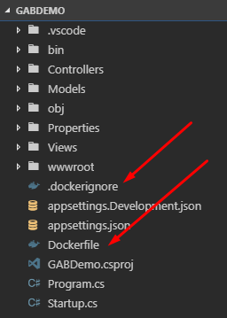
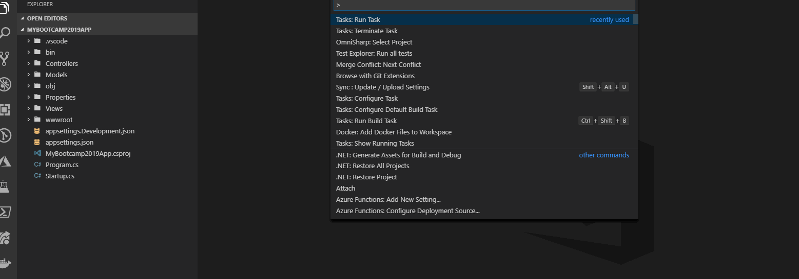
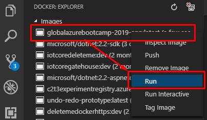
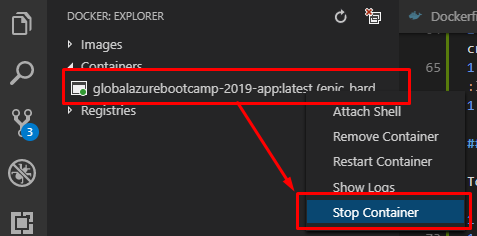

![gablogo][gablogo]

# Lab 3 - Docker Container part 1

## Goal

We will package the Application in a Docker container. Run it locally. Deploy manually to Azure using Azure CLI

## Let's code!

In this lab, we will execute the following steps:

1. Make our project ready for docker
1. Build our first Docker image
1. Run our dockerized application locally
1. Learn how to stop our running container
1. Deploy our dockerized application to Azure
1. Cleaning up resources

### Make our project ready for docker

We will first create a `Dockerfile` and optionally a `.dockerignore` file at the root of our project.



You have multiple options to achieve that, here are the two covered here:

-   Setting up docker manually
-   Setting up docker using VS Code Docker extension

Feel free to use the method that you prefer.

#### Setting up docker manually

You can create those files using your favorite text editor like VS Code.

1. Create `.dockerignore` (no file name, only an extension) at the root of your project.
2. Copy the following text into `.dockerignore`:

    ```
    node_modules
    npm-debug.log
    Dockerfile*
    docker-compose*
    .dockerignore
    .git
    .gitignore
    .env
    */bin
    */obj
    README.md
    LICENSE
    .vscode
    ```

3. Create `Dockerfile` (no extension) at the root of your project.
4. Copy the following text into `Dockerfile`:

    ```
    FROM microsoft/dotnet:2.2-aspnetcore-runtime AS base
    WORKDIR /app
    EXPOSE 80

    FROM microsoft/dotnet:2.2-sdk AS build
    WORKDIR /src
    COPY ["GABDemo.csproj", "./"]
    RUN dotnet restore "./GABDemo.csproj"
    COPY . .
    WORKDIR "/src/."
    RUN dotnet build "GABDemo.csproj" -c Release -o /app

    FROM build AS publish
    RUN dotnet publish "GABDemo.csproj" -c Release -o /app

    FROM base AS final
    WORKDIR /app
    COPY --from=publish /app .
    ENTRYPOINT ["dotnet", "GABDemo.dll"]
    ```

#### Setting up docker using VS Code Docker extension

Using VS Code Docker extension, it is as simple as this:

1. Open VS Code command palette (`ctrl+shift+p`).
1. Select or type `Docker: Add Docker Files to Workspace`.
1. [optional] If you are in a Workspace, select the folder that you want to create the `Dockerfile` into.
1. Select `ASP.NET Core` as the Application Platform.
1. Select `Linux` as the Operating System.
1. Hit `Enter` and select the default `80` port for the application to listen to (any other port of your choosing should work as well).
1. [optional] if you have multiple projects, select the application `.csproj` file.



This should have created a `Dockerfile` similar to (assuming your application is named `GABDemo` and the `GABDemo.csproj` file is at the same level as the `Dockerfile`):

```dockerfile
FROM microsoft/dotnet:2.2-aspnetcore-runtime AS base
WORKDIR /app
EXPOSE 80

FROM microsoft/dotnet:2.2-sdk AS build
WORKDIR /src
COPY ["GABDemo.csproj", "./"]
RUN dotnet restore "./GABDemo.csproj"
COPY . .
WORKDIR "/src/."
RUN dotnet build "GABDemo.csproj" -c Release -o /app

FROM build AS publish
RUN dotnet publish "GABDemo.csproj" -c Release -o /app

FROM base AS final
WORKDIR /app
COPY --from=publish /app .
ENTRYPOINT ["dotnet", "GABDemo.dll"]
```

Depending on your project structure, you may end up with a slightly different `Dockerfile`.

### Build our first Docker image

The next step is to build the docker image of your application.
Once again, we have multiple choices. Here are two:

-   Using the Docker CLI
-   Using VS Code Docker extension

#### Using the Docker CLI

To create a Docker image manually:

1. Open a terminal
    - In VS Code you can `` ctrl+` `` or click `View > Terminal`.
        > You can even have multiple terminals opened at the same time. On Windows 10, they can be `cmd`, `PowerShell` and even `bash` if you have a Linux subsystem installed!
    - In Windows 10 you can open PowerShell by `right-click Start Menu > Windows PowerShell` or from Explorer (`Windows+E`): `File > Open Windows PowerShell`.
    - In MacOS or Linux open `bash` ([How to use the Terminal command line in macOS](https://macpaw.com/how-to/use-terminal-on-mac)).
1. Type the following command:

    ```bash
    docker build --rm -f "Dockerfile" -t gabdemo:latest .
    ```

1. Wait for Docker to complete; this may take a few minutes the first time, but don't worry, it gets faster afterward.

#### Using VS Code Docker extension

Using VS Code Docker extension, it is as simple as this:

1. Open VS Code command palette (`ctrl+shift+p`).
1. Select or type `Docker: Build Image`.
1. [optional] If you are in a Workspace, select the folder that you created the `Dockerfile` into.
1. Hit enter to acknowledge the default tag name of `[your application]:latest`.
1. Wait for Docker to complete; this may take a few minutes the first time, but don't worry, it gets faster afterward.

### Run our dockerized application locally

This can again be achieved by following different paths, and we have the following two to offer you:

-   Using the Docker CLI
-   Using VS Code Docker Explorer

#### Using the Docker CLI

To run a Docker image manually:

1. Open a terminal
1. Type the following command:

    ```bash
    docker run --rm -d -p 80:80/tcp --name gabdemo gabdemo:latest
    ```

1. Browse to `http://localhost` using your favorite browser to enjoy navigating your newly dockerized website.

> IMPORTANT: if you don't supply the `--name` parameter, the Docker daemon will generate a UUID automatically for you. That means that if you want to stop your container later without searching for its ID manually, you can copy the CONTAINER ID that was outputted into the terminal window; this should be a string looking like this: `d8897f7bd10783d075260d953eec8a06885350bf8acc8322c0e4143432f01237`.

#### Using VS Code Docker Explorer

To run your dockerized application using Docker Explorer, do:

1. In VS Code, click on the `Docker icon` (left). 
1. Under `Images`, locate the image you created and `right-click` on it then select `Run`. _The running container should appear under `Containers`._
1. Browse to `http://localhost` using your favorite browser to enjoy navigating your newly dockerized website.



### Learn how to stop our running container

This can again be achieved following different methods, and we have the following two for you:

-   Using the Docker CLI
-   Using VS Code Docker Explorer

#### Using the Docker CLI

To stop a running container manually, if you know the CONTAINER ID:

1. Open a terminal
1. Type the following command to search for the ID of the running container:

    ```bash
    # if you have supplied the name parameter
    docker stop [ENTER YOUR CONTAINER NAME HERE]
    # if you have not supplied a name parameter
    docker stop [ENTER THE CONTAINER ID THAT YOU WANT TO STOP HERE]
    # For example:
    # with the name parameter
    docker stop gabdemo
    # with UUID
    docker stop d8897f7bd10783d075260d953eec8a06885350bf8acc8322c0e4143432f01237
    # Or using the shorter ID:
    docker stop d8897f7bd107
    ```

If you do not know the CONTAINER ID, you can find the ID of all running containers by running the following command:

```bash
docker ps
```

Once you located the container that you want to stop, copy its ID (`ctrl+C`) and execute the `docker stop` command.

#### How to stop all running containers

**Tip of the day:** you can run the following command to stop all running containers:

```bash
docker stop $(docker ps -a -q)
```

#### Using VS Code Docker Explorer

To stop the container using Docker Explorer, you can:

1. In VS Code, click on the `Docker icon` (left).
1. Under `Images`, locate the image you created and `right-click` on it then select `Stop Container`. _The running container should then disappear from under `Containers`._



### Deploy our dockerized application to Azure

To deploy our application and run it in the Cloud, we will use both Docker and the Azure CLI (version 2.0.55 or later recommended).
What we will do is:

1. Create an Azure Resource Group to create our resources into. It helps keep our stuff organized, and it is easier to clean up this way.
1. Create a private image registry (we could have used Docker Hub as well, but the event is named Azure Bootcamp; and our images will be closer to our running containers, helping with latency in a real-world scenario).
1. Push our Docker image in our private registry
1. Deploy a container, based on our Docker image, to an Azure Container Instance.

To do that:

1. Open a terminal
1. Create a resource group:

    ```bash
    # Create a resource group in Toronto
    az group create --name GAB2019Group --location canadacentral
    # Create a resource group in Québec
    az group create --name GAB2019Group --location canadaeast
    ```

1. Create a container registry (to push our Docker image into). The `<acrName>` must be unique Azure-wide (not just your account). For example, I named mine `GAB2019ContainerRegistry`.

    ```bash
    az acr create --resource-group GAB2019Group --name <acrName> --sku Basic --admin-enabled true
    ```

    > Take note of the registry `name` you entered here. Throughout the rest of this quickstart `<acrName>` is a placeholder for the container registry name.
    >
    > Take note of `loginServer` in the output, which is the fully qualified registry name (all lowercase). Throughout the rest of this quickstart `<acrLoginServer>` is a placeholder for the container registry name.

1. From there we need one of the admin password generated for us by Azure. To get those we must:

    1. Log in to the [Azure Portal](https://portal.azure.com)
    1. Navigate to our container registry: `<acrName>`
    1. Navigate to `Access keys`
    1. Copy the Username (which should be the same as the registry name) and one of the two passwords.

    > Instead of using this admin password, it would be possible to save credentials into Azure Key Vault.
    > That would be more secure for a production scenario; for a demo, this way is easier and faster.

1. Log in the Docker CLI to the registry:

    ```bash
    az acr login --name <acrName>
    ```

1. Tag our Docker image with our private Docker repository name

    ```bash
    docker tag gabdemo <acrLoginServer>/gabdemo:v1
    ```

1. Push our Docker image into our private container registry:

    ```bash
    docker push <acrLoginServer>/gabdemo:v1
    ```

1. Create a container in Azure. The `dns-name-label` must be unique Azure-wide. For example, I named mine: `gab-2019-container-demo`.

    ```bash
    az container create --resource-group GAB2019Group --name gab2019container --image <acrLoginServer>/gabdemo:v1 --dns-name-label <dns-name-label> --ports 80
    # Enter your admin Azure Container Registry username and password (copied a few steps ago).
    ```

1. From there, we can list our running containers:

    ```bash
    az container show --resource-group GAB2019Group --name gab2019container --query "{FQDN:ipAddress.fqdn,ProvisioningState:provisioningState}" --out table
    ```

1. Copy the FQDN (that should look like `gab-2019-container-demo.canadacentral.azurecontainer.io`).
1. Using a browser, navigate to that URI, ex.: `http://gab-2019-container-demo.canadacentral.azurecontainer.io/` and you should see your container running in the Cloud!


## Reference

-   [Install the Azure CLI](https://docs.microsoft.com/en-us/cli/azure/install-azure-cli?view=azure-cli-latest?WT.mc_id=globalazure-github-frbouche)
-   [Quickstart: Create a private container registry using the Azure CLI](https://docs.microsoft.com/en-us/azure/container-registry/container-registry-get-started-azure-cli?WT.mc_id=globalazure-github-frbouche)
-   [Quickstart: Run a container application in Azure Container Instances with the Azure CLI](https://docs.microsoft.com/en-us/azure/container-instances/container-instances-quickstart?WT.mc_id=globalazure-github-frbouche)

## End

[Previous Lab](../Lab2/README.md)

[Next Lab](../Lab4/README.md)

[gablogo]: ../medias/GlobalAzureBootcamp2019.png 'Global Azure Bootcamp 2019'
